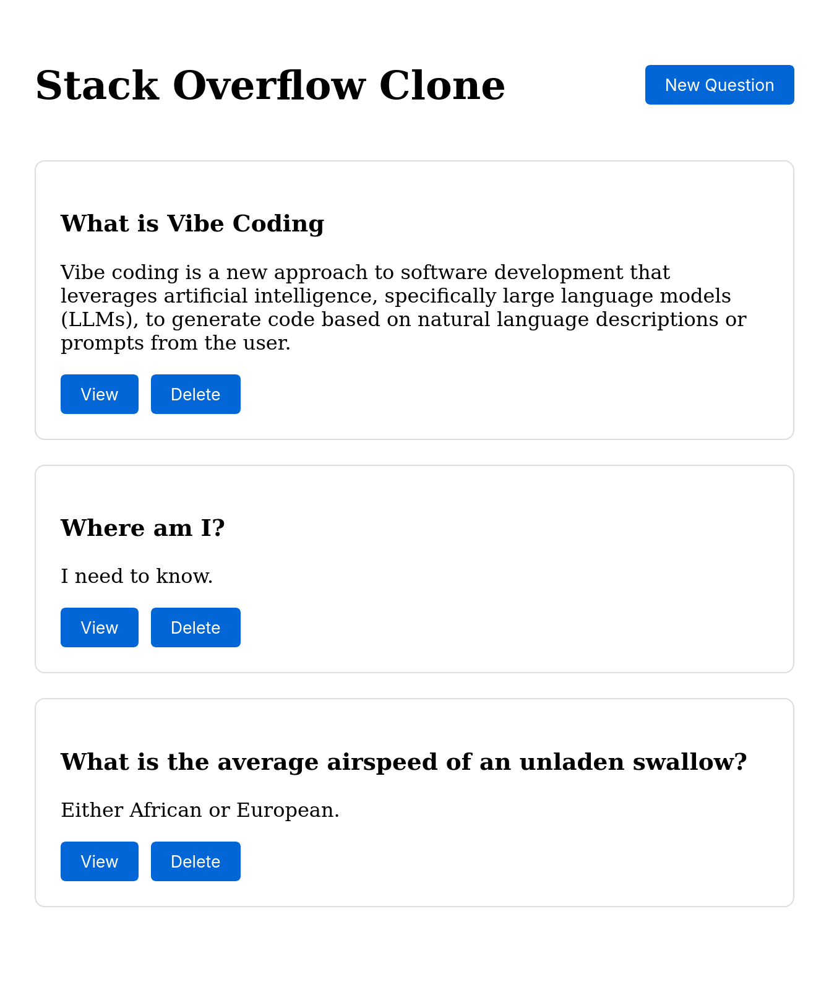
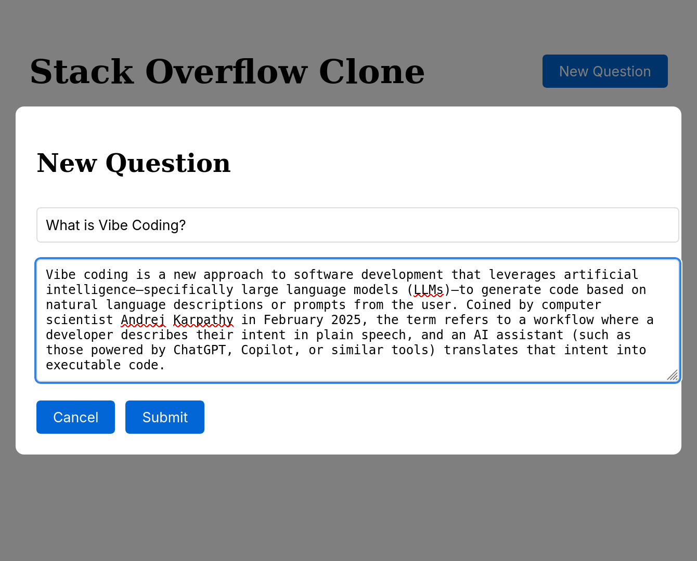
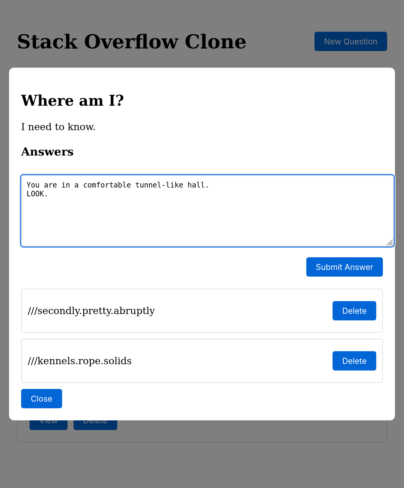

# Stackoverflow Clone Frontend
## Description
Vibe coded UI to interact with LGR's second CLI project: Stackoverflow Clone. Using Claude 3.5 Sonnet, 45k tokens and much patience and iteration, Claude was able to create this web UI, including making a required change to the backend to apply CORS settings.

It's also quite buggy...

## Requirements
trunk

## Running
- Ensure the backend is running
- `trunk serve`

## Screenshots
### The Main Page

### Add a Question

### Add an Answer

